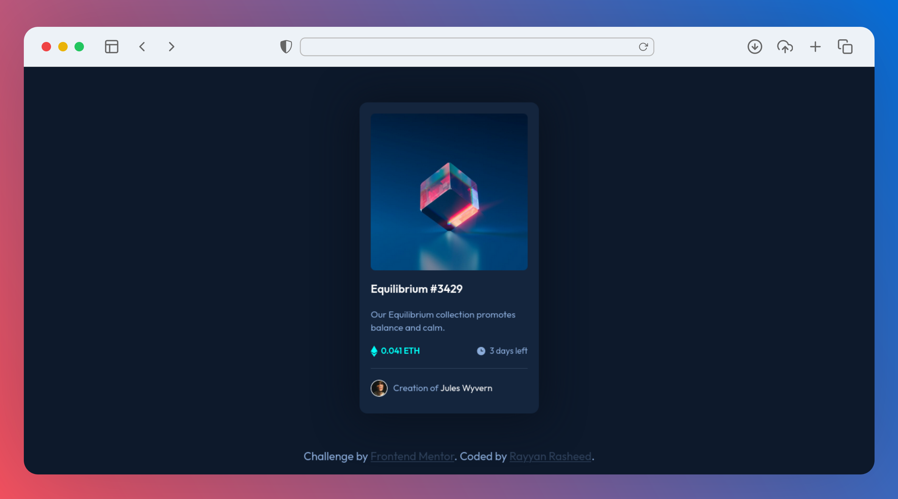

# Frontend Mentor - NFT Preview Card Component Solution

This is a solution to the [NFT preview card component challenge on Frontend Mentor](https://www.frontendmentor.io/challenges/nft-preview-card-component-SbdUL_w0U). Frontend Mentor challenges help you improve your coding skills by building realistic projects.

## Table of contents

- [Overview](#overview)
  - [Screenshot](#screenshot)
  - [Links](#links)
- [My process](#my-process)
  - [Built with](#built-with)
- [Author](#author)

## Overview

### Screenshot

### Links

- Solution URL: [NFT Preview Card](https://www.frontendmentor.io/solutions/nft-preview-card-component-S1iADHYNq)

## My process

### Built with

- HTML5
- CSS3
- Google Fonts

## Author

- Frontend Mentor - [@RayyanRNKJ](https://www.frontendmentor.io/profile/RayyanRNKJ)
- Linkedin - [Rayyan Rasheed](https://www.linkedin.com/in/rayyan-rasheed-2623b41b3/)
